# UltraGame

Motor **2D y 3D** para la web en **un solo archivo JavaScript sin dependencias**: WebGPU, WebGL2, WebGL y Canvas 2D con respaldo automático, escenas al estilo Phaser, grafo de escena al estilo PixiJS, física Arcade 2D y física 3D de personajes y vehículos, mapas de **Tiled**, modelos **glTF/GLB de Blender** y OBJ, audio con sintetizador y audio posicional 3D, partículas 2D (con **WebAssembly SIMD**) y 3D, 35 efectos de post-proceso, controles táctiles y herramientas de seguridad pensadas para juegos web3.

Incluye **UltraGame Studio**, un editor de escritorio para crear juegos 2D y 3D sin programar (objetos, comportamientos y hojas de eventos) o programando (scripts JavaScript), con exportación a HTML5.

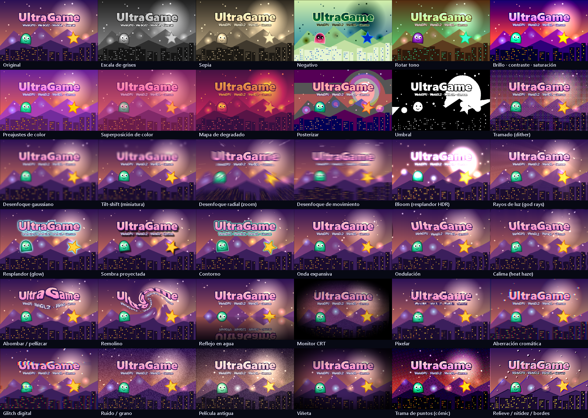

## Contenido

| Carpeta | Qué hay |
| --- | --- |
| `dist/` | `ultragame.js` (UMD: `<script>`, CommonJS, AMD), `ultragame.esm.js` (módulo ES) y `ultragame.d.ts` (tipos TypeScript, 2D + 3D) |
| `src/` | Código fuente por módulos (núcleo, render WebGPU/WebGL/Canvas, filtros, física, Tiled, audio, `3d_*.js`…) |
| `studio/` | **UltraGame Studio**: editor (`index.html`, `js/`), esquema compartido (`shared/`), runtime de juegos y reproductor aislado (`runtime/`) |
| `docs/` | Documentación en español: motor (`docs/index.html`) y Studio (`docs/studio.html`) |
| `examples/` | Galería interactiva de efectos (`effects.html`) |
| `minigames/` | 8 juegos 2D con lanzador (`minigames/index.html`) |
| `games3d/` | 8 juegos 3D con lanzador (`games3d/index.html`) |
| `assets3d/` | 22 modelos GLB de ejemplo (personajes animados, coches, casas, naturaleza, objetos) generados por `tools/make-models.js` |
| `tests/` | Pruebas en navegador (2D, 3D, runtime del Studio), pruebas en Node, humo de juegos, benchmarks y capturas |
| `tools/` | Build, servidor local, servidor del Studio, generador de modelos, codificador PNG, núcleo WASM |
| `types/` | Fuente de los tipos TypeScript (motor y API de scripts del Studio) |

## UltraGame Studio

```bash
# Windows: doble clic en «UltraGame Studio.cmd»
./studio.sh          # macOS / Linux
npm run studio       # cualquier sistema con Node.js 18+
```

Se abre en una ventana de aplicación de Edge/Chrome. Los proyectos se guardan en `projects/`. Plantillas incluidas: vacío 2D/3D, plataformas 2D, naves 2D, aventura 3D en tercera persona, shooter en primera persona y carreras 3D. Guía completa en `docs/studio.html`.

## Inicio rápido (2D)

```html
<div id="juego"></div>
<script src="dist/ultragame.js"></script>
<script>
  const Principal = {
    key: 'Principal',
    create() {
      this.textures.generate('bola', 32, 32, (c) => { c.fillStyle = '#ffd43b'; c.beginPath(); c.arc(16, 16, 15, 0, Math.PI * 2); c.fill(); });
      const bola = this.physics.add.sprite(400, 100, 'bola');
      bola.body.setBounce(0.8).setCollideWorldBounds(true);
      this.add.text(20, 20, '¡Hola, UltraGame!', { fontSize: 28, fill: 0xffffff });
      this.cameras.main.setFilters([new UG.BloomFilter()]);
    }
  };
  new UG.Game({ parent: 'juego', width: 800, height: 600, physics: { arcade: { gravity: { y: 900 } } }, scenes: [Principal] });
</script>
```

## Inicio rápido (3D)

```js
const Mundo = {
  key: 'Mundo',
  preload() { this.load.gltf('robot', 'assets3d/robot.glb'); },   // o tu modelo exportado desde Blender (.glb)
  create() {
    const v = this.add.view3d();                                   // vista 3D a pantalla completa
    v.add.sunlight();                                              // sol con sombras + cielo/suelo
    v.add.box(20, 1, 20, { color: 0x6a8a5a }).position.y = -0.5;
    v.add.model('robot').play('Walk');
    v.orbitControls({ distance: 6 });
  }
};
new UG.Game({ width: 1280, height: 720, scenes: [Mundo] });
```

Con módulos: `import UG from './dist/ultragame.esm.js'`. En Node: `const UG = require('./dist/ultragame.js')` (lógica sin navegador: física 2D y 3D, glTF, Tiled, tweens, RNG, seguridad…).

## Ejecutar en local

```bash
node tools/build.js                            # compila src/ -> dist/ (y copia los tipos)
node tools/server.js --port 8080 --allow-save  # servidor estático en 127.0.0.1 (el guardado lo usan las páginas de captura)
node tests/node-tests.js                       # 83 pruebas sin navegador (2D, 3D y Studio)
```

Después abre:

- `http://127.0.0.1:8080/minigames/index.html` — los 8 minijuegos 2D
- `http://127.0.0.1:8080/games3d/index.html` — los 8 juegos 3D
- `http://127.0.0.1:8080/docs/index.html` — documentación del motor · `docs/studio.html` — guía del Studio
- `http://127.0.0.1:8080/examples/effects.html` — galería de efectos (`?tools=1` para regenerar las muestras)
- `http://127.0.0.1:8080/tests/index.html` — batería de pruebas 2D (~290 pruebas en los 4 backends, incluidas fugas de memoria)
- `http://127.0.0.1:8080/tests/3d-basic.html` y `3d-models.html` — render 3D por píxeles y carga de modelos
- `http://127.0.0.1:8080/tests/capture-thumbs3d.html?smoke=1` — los 8 juegos 3D jugados por su bot en WebGPU/WebGL2/WebGL con control de errores y fugas
- `http://127.0.0.1:8080/tests/studio-runtime.html?auto=1` — runtime del Studio
- `http://127.0.0.1:8080/tests/bench.html` — benchmarks

## Juegos

| | 2D | | 3D |
| --- | --- | --- | --- |
| 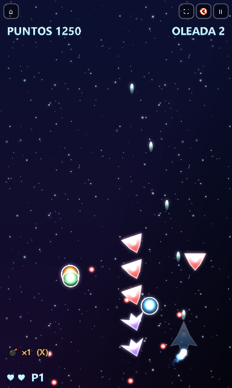 | **Star Blaster** — shooter vertical | 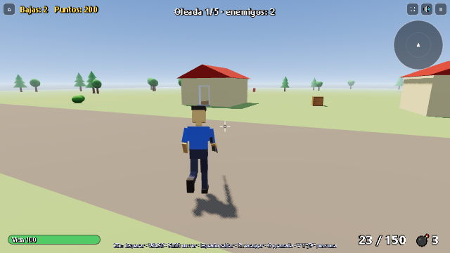 | **Operación Tormenta** — shooter en 1ª y 3ª persona con casas y robots |
| 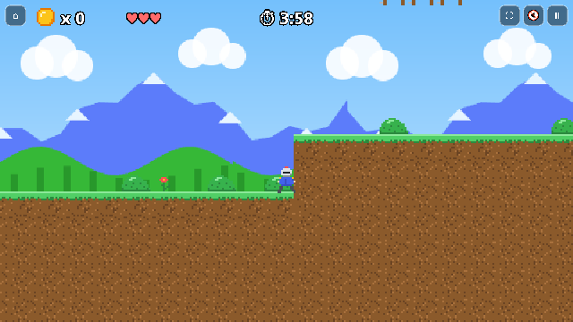 | **Pixel Knight** — plataformas con Tiled | 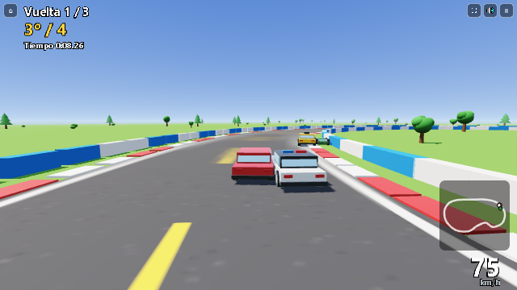 | **Turbo Circuito** — carreras con rivales |
| 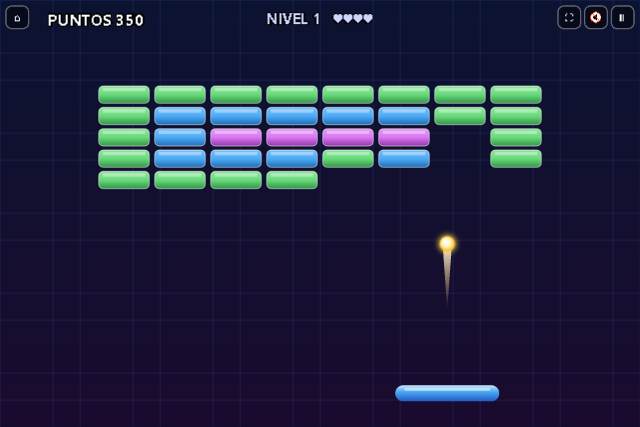 | **Brick Breaker** — arcade | 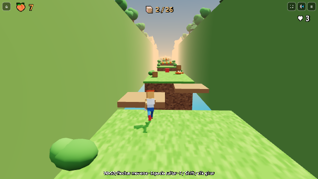 | **Bandicrash** — plataformas tipo Crash Bandicoot |
| 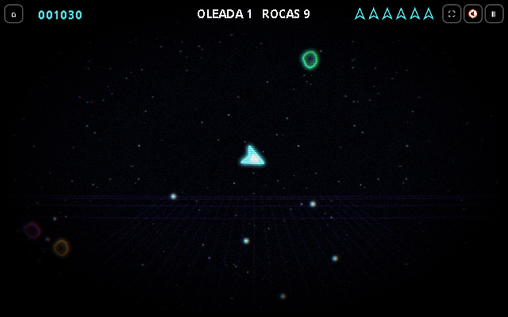 | **Neon Asteroids** — 360° | 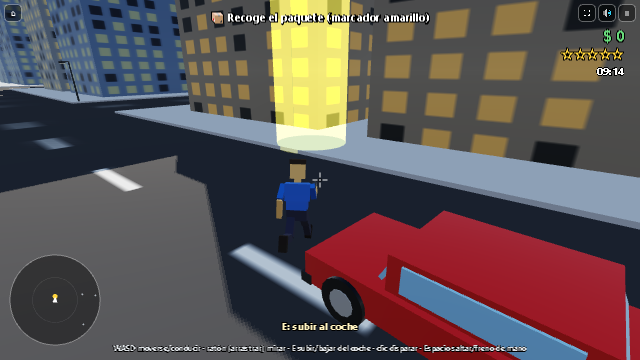 | **Ciudad Libre** — mundo abierto tipo GTA |
| 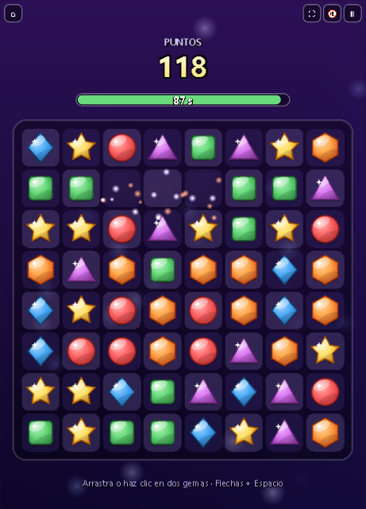 | **Gem Match** — match-3 | 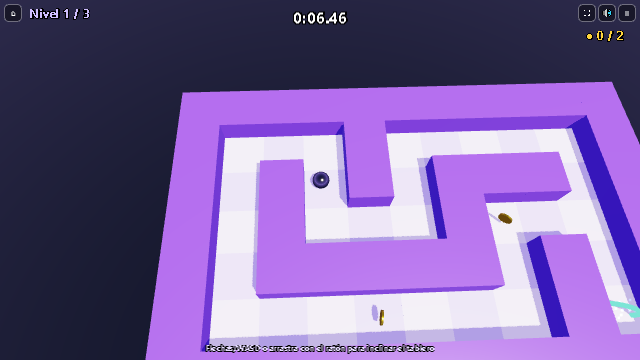 | **Laberinto Inclinado** — puzle de física |
| 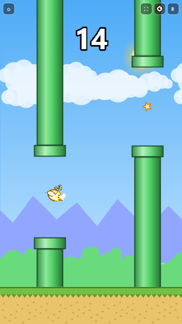 | **Sky Hopper** — un botón | 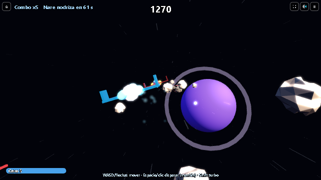 | **Galaxia 3D** — shooter espacial |
| 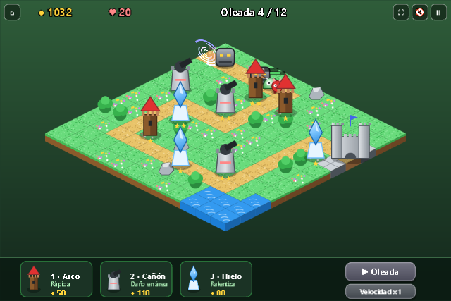 | **Iso Defense** — torres isométricas | 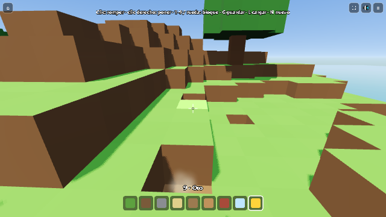 | **Bloques** — sandbox de vóxeles |
| 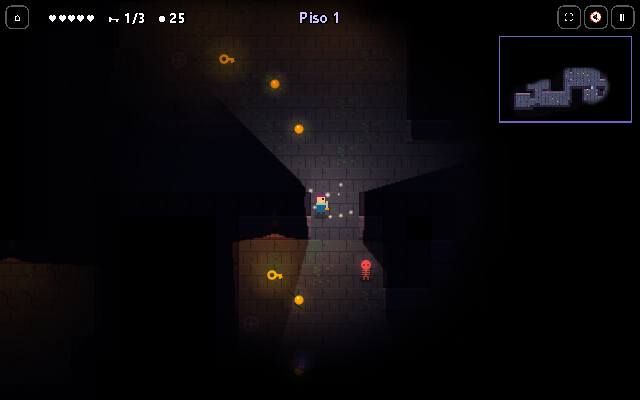 | **Dungeon Lights** — roguelite | 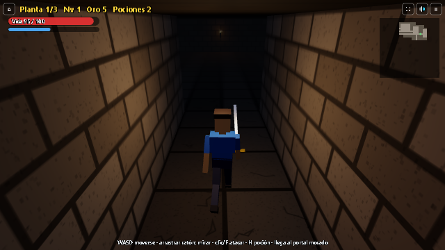 | **Mazmorra** — RPG de acción |

## Seguridad

El bundle no usa `eval`, `new Function`, `innerHTML` ni `document.write` (lo comprueban el build y las pruebas); valida URLs y orígenes, verifica integridad SRI, rechaza *prototype pollution* en datos externos, valida por completo los glTF/GLB (límites, índices, ciclos, NaN) y limita mapas, descompresión, texturas, textos y partículas. El Studio solo escucha en 127.0.0.1 con sesión por cookie `HttpOnly`/`SameSite=Strict`, comprobación de `Host` y `Origin`, rutas confinadas y juego en iframe `sandbox`. Para juegos web3: nunca guardes claves en el cliente, decide el valor en servidor o contrato, y usa semilla + `UG.InputLog` + `UG.Debug.hashState` para partidas verificables. Detalles en `docs/index.html#seguridad`.

## Limitaciones conocidas

- El núcleo acelerado es WebAssembly SIMD escrito a mano (`tools/wasm/`), no C++ compilado; hoy acelera la integración de partículas 2D.
- El bundle se distribuye sin minificar (≈1,1 MB con el 3D; ≈300 KB con gzip).
- En Canvas 2D se omiten los efectos que no tienen equivalente CSS y no hay 3D.
- glTF: sin compresión Draco/meshopt, sin texturas KTX2 y sin *morph targets* (se usa la forma base y se avisa).
- Física 3D pensada para juegos: los cuerpos dinámicos no rotan por choques y no hay uniones.
- El Studio es una aplicación web local en una ventana de Edge/Chrome (no se ha empaquetado con Electron).
- No se han medido PixiJS, Phaser ni three.js en el mismo equipo: las cifras publicadas son solo de UltraGame.
- Los tipos TypeScript están escritos a mano y verificados contra las exportaciones reales, pero no se han compilado con `tsc` en este entorno.
- Ninguna biblioteca puede garantizar la ausencia total de vulnerabilidades; el motor y el Studio aplican defensas razonables.

## Licencia

MIT.
